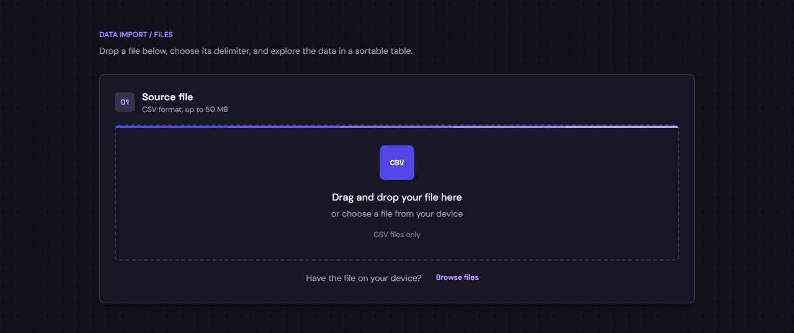
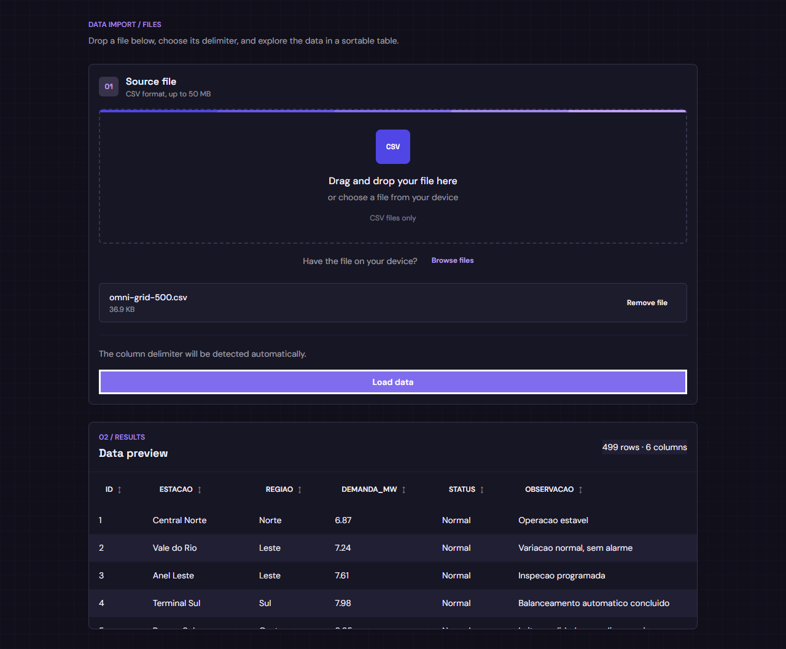
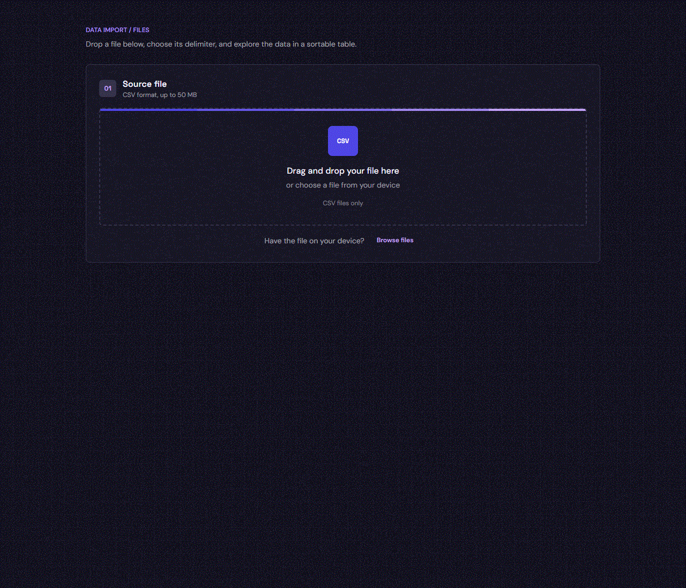

# OmniGrid

This application was created to evaluate Bun and its web development tooling.

Bun documentation:
https://bun.com/docs/quickstart

To install dependencies:

```bash
bun install
```

To run:

```bash
bun start
```

## Screenshots

### CSV import



### Data preview



### Workflow



## Frontend

The page at `/` is a static HTML dashboard styled with Tailwind CSS 4 and daisyUI 5. Its CSS entry point is `src/web/styles.css`:

```css
@import "tailwindcss";
@plugin "daisyui" {
  themes: omni-dark --default;
}
```

The custom `omni-dark` theme uses the violet palette and is defined in `src/web/styles.css`.

The `build:css` script uses `@tailwindcss/cli` to generate `src/web/tailwind.generated.css`. `build:js` bundles the browser code to `src/web/app.generated.js`; `bun start` builds both assets before starting the server.
By default, the server starts at `http://localhost:3000/` (port `3000`). Set `PORT` to a different port; for example, using port `4000` serves the app at `http://localhost:4000/`.

CSV files are parsed locally in the browser. The selected file is not uploaded to the server.
Drop a `.csv` file up to 50 MB and load it; PapaParse detects the delimiter automatically. The first row supplies the column names; click a column heading to sort ascending or descending.

## Dependencies and imports

| Package | Type | Import or use |
| --- | --- | --- |
| `figlet` | Runtime dependency | Imported in `src/server.ts` for the startup banner and `src/routes/index.ts` for `/figlet`. |
| `tailwindcss` | Development dependency | Loaded in `src/web/styles.css` with `@import "tailwindcss";`. |
| `daisyui` | Development dependency | Loaded as a Tailwind plugin in `src/web/styles.css`. |
| `@tailwindcss/cli` | Development dependency | Runs `build:css` to compile the frontend stylesheet. |
| `papaparse` | Development dependency | Imported by `src/web/app.js` for CSV parsing in the browser bundle. |

The shared HTML title is exported as `APP_TITLE` from `src/config/app.ts`, imported by `src/server.ts`, and inserted into the `{{APP_TITLE}}` token in each served page's `<title>` element.

## Endpoints

| Method | Path | Response |
| --- | --- | --- |
| `GET` | `/` | Serves the HTML application. |
| `GET` | `/tailwind.css` | Serves the compiled Tailwind and daisyUI stylesheet. |
| `GET` | `/app.js` | Serves the compiled browser application. |
| `GET` | `/figlet` | Plain text containing the Figlet rendering of `BUN SERVER`. |
| `GET` | `/omnigrid/health` | JSON health status: `{"status":"UP"}`. |

This project was created using `bun init` in bun v1.4.2. [Bun](https://bun.com) is a fast all-in-one JavaScript runtime.
